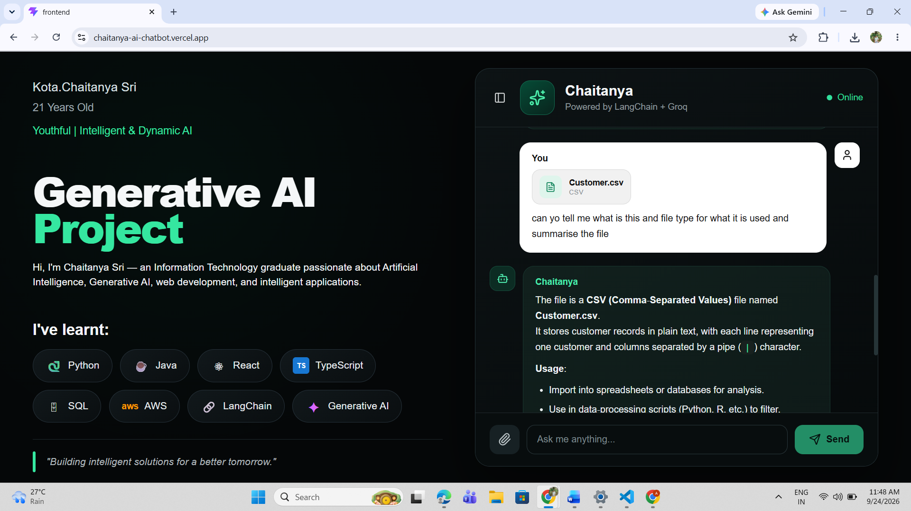

# Chaitanya AI — Personal & General AI Assistant

An AI chatbot that works as both a **personal portfolio assistant** (ask about my projects, skills, education and experience) and a **general assistant** for coding help, technical explanations and document Q&A.

**🔗 Live demo:** https://chaitanya-ai-chatbot.vercel.app

<!-- Add a screenshot or GIF here:   -->

## Features

- 🤖 **Two-in-one assistant** — answers questions about me, and general questions too
- 💬 **Chat history sidebar** — past conversations, auto-titled from your first question, reopen or delete any chat
- 🧠 **Conversation memory** — each chat keeps its context across messages (server-side sessions with a 6-hour expiry)
- 📎 **Document Q&A** — attach a file and ask questions about it. Supports PDF, DOCX, TXT, CSV, PPTX and XLSX (up to 5 MB)
- 📄 **Attachment cards** — the attached file is shown on the message it belongs to, and is restored when you reopen a chat
- 🛡️ **Basic protection** — per-IP rate limiting and CORS restricted to the frontend origin
- 💾 **Optional Redis storage** — set `REDIS_URL` to keep sessions and chat history across restarts; falls back to in-memory storage without it

## Tech stack

| Layer | Tools |
|---|---|
| Frontend | React, TypeScript, Vite, react-markdown |
| Backend | Python, FastAPI, Uvicorn |
| AI | LangChain, Groq (`openai/gpt-oss-20b`) |
| Storage | Redis (optional), in-memory fallback |
| File parsing | pypdf, python-docx, python-pptx, openpyxl, csv |
| Deployment | Vercel (frontend), hosted FastAPI service (backend) |

## How it works

1. The React app sends each message, plus session and browser ids, to the FastAPI `/chat` endpoint.
2. The backend loads the session history, adds the system prompt and any attached document text, and calls the Groq model through LangChain.
3. The reply and updated history are stored per session, and the session is indexed under the browser so it appears in the sidebar.
4. Extra endpoints list a browser's chats, load one back in, and delete one.

## Run locally

**Backend**

```bash
cd backend
python -m venv venv
venv\Scripts\activate        # macOS/Linux: source venv/bin/activate
pip install -r requirements.txt
```

Create `backend/.env`:

```env
GROQ_API_KEY=your_groq_api_key
# Optional:
# REDIS_URL=redis://...
# ALLOWED_ORIGINS=http://localhost:5173
```

```bash
uvicorn app:app --reload
```

**Frontend**

```bash
cd frontend
npm install
```

Create `frontend/.env`:

```env
VITE_API_URL=http://localhost:8000
```

```bash
npm run dev
```

## Limitations

- There is no login. Chat history is tied to the browser (localStorage), so clearing browser data or switching devices loses the list.
- Uploaded files are read once; only the text is used as context, and a reopened chat remembers the file name but not its contents.
- The backend can be slow on the first request after a quiet period on free hosting.

## Author

**Kota Chaitanya Sri** — Information Technology graduate interested in Generative AI, web development and intelligent applications.